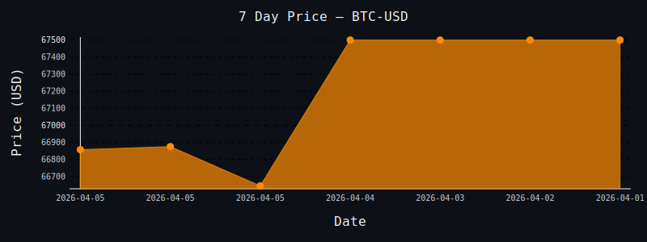
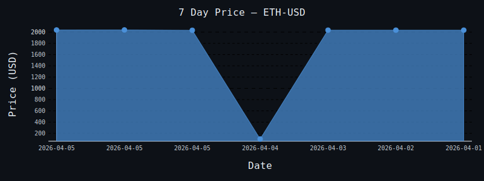

# Cryptocurrency Board

> Last updated: 2026-04-05 06:16 UTC

## Market Overview

| Coin | Price (USD) | 24h Change |
|------|-------------|------------|
| **BTC** | **$66,646.00** | ▼ -0.5% |
| **ETH** | **$2,031.85** | ▼ -1.1% |

## BTC — 7 Day Chart

## ETH — 7 Day Chart

## 7-Day Summary

| Coin | High | Low | Avg |
|------|------|-----|-----|
| **BTC** | $67,500.00 | $66,646.00 | $67,225.25 |
| **ETH** | $2,033.88 | $100.00 | $1,751.05 |
