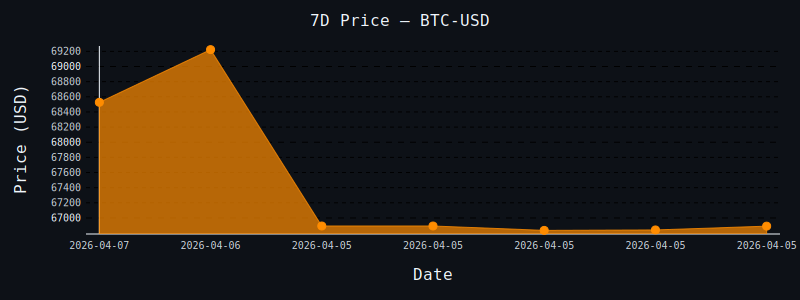
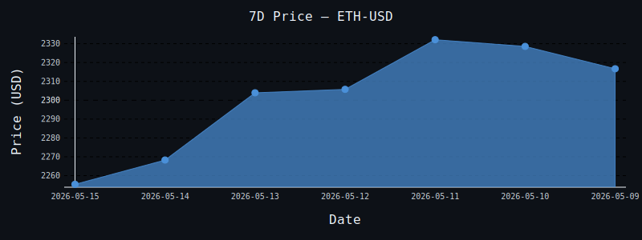
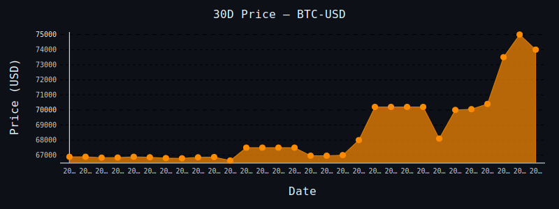
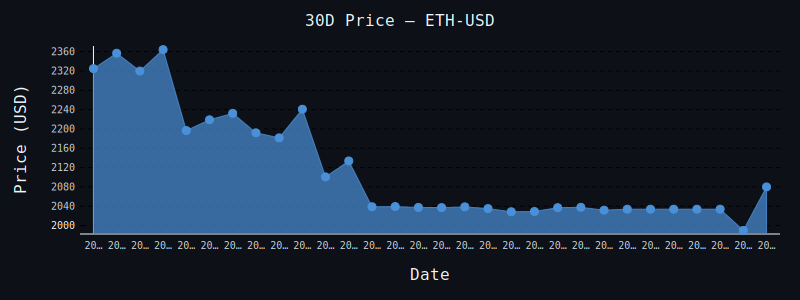
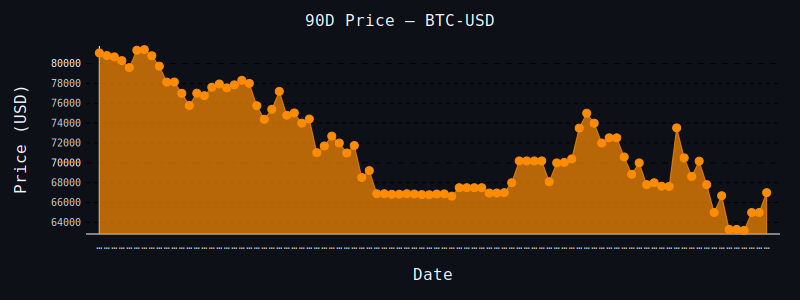
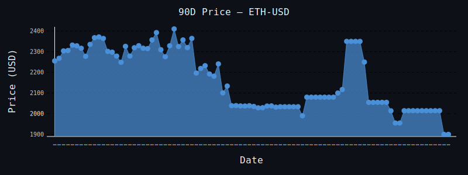
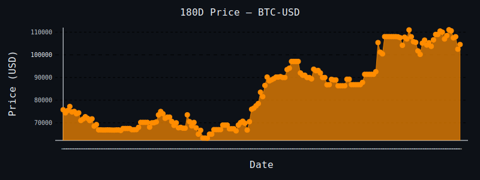
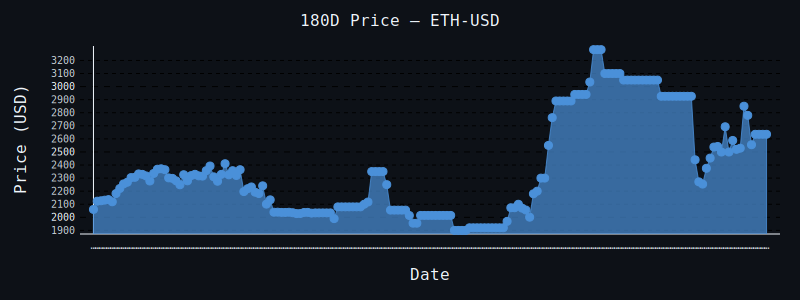
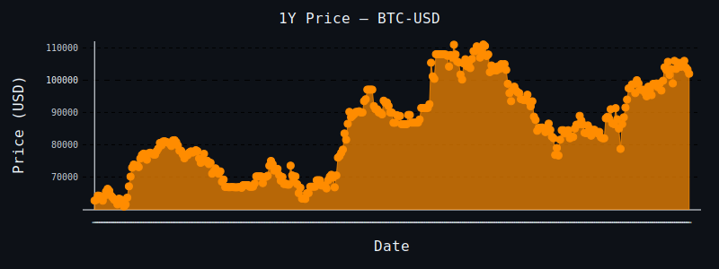
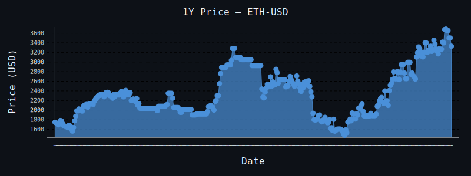

# Cryptocurrency Board

> Last updated: 2026-05-19 07:01 UTC

## Market Overview

| Coin | Price (USD) | 24h Change |
| ---- | ----------- | ---------- |
| **BTC** | **$76,962.00** | ▲ +0.0% |
| **ETH** | **$2,135.55** | ▲ +0.8% |

## 7-Day Dashboard

| Coin | Min | Max | Avg | Median | Return % | Volatility |
|------|-----|-----|-----|--------|----------|------------|
| **BTC** | $76,916.00 | $81,028.00 | $78,878.57 | $78,837.00 | -5.0% | 1.13% |
| **ETH** | $2,118.79 | $2,303.96 | $2,212.04 | $2,220.43 | -7.3% | 1.24% |

## 30D Dashboard

| Coin | Min | Max | Avg | Median | Return % | Volatility |
|------|-----|-----|-----|--------|----------|------------|
| **BTC** | $74,395.00 | $81,410.00 | $78,608.27 | $78,142.50 | +3.5% | 1.26% |
| **ETH** | $2,118.79 | $2,392.49 | $2,294.39 | $2,307.73 | -6.2% | 1.66% |

## 90D Dashboard

| Coin | Min | Max | Avg | Median | Return % | Volatility |
|------|-----|-----|-----|--------|----------|------------|
| **BTC** | $65,000.00 | $81,410.00 | $72,735.77 | $71,871.50 | +18.4% | 1.97% |
| **ETH** | $1,955.00 | $2,410.17 | $2,174.59 | $2,158.60 | +6.0% | 2.41% |

## 180D Dashboard

| Coin | Min | Max | Avg | Median | Return % | Volatility |
|------|-----|-----|-----|--------|----------|------------|
| **BTC** | $63,200.00 | $108,044.00 | $79,065.23 | $76,984.50 | -28.7% | 2.36% |
| **ETH** | $1,900.00 | $3,282.87 | $2,376.65 | $2,300.00 | -14.9% | 3.24% |

## 1Y Dashboard

| Coin | Min | Max | Avg | Median | Return % | Volatility |
|------|-----|-----|-----|--------|----------|------------|
| **BTC** | $63,200.00 | $111,065.37 | $87,480.75 | $88,500.00 | -20.2% | 2.53% |
| **ETH** | $1,479.00 | $4,050.00 | $2,519.18 | $2,356.91 | -40.7% | 4.09% |

---

## Deep Stats

### 1Y

| Coin    | Range %                                                 | Drawdown %                                                 |
| ------- | ------------------------------------------------------- | ---------------------------------------------------------- |
| **BTC** | 75.7% | 43.1% |
| **ETH** | 173.8% | 63.5% |

