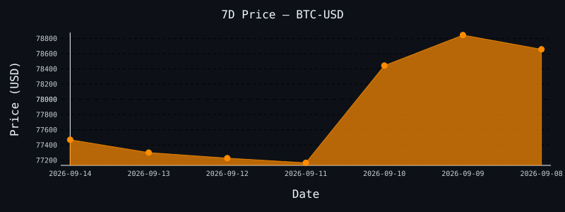
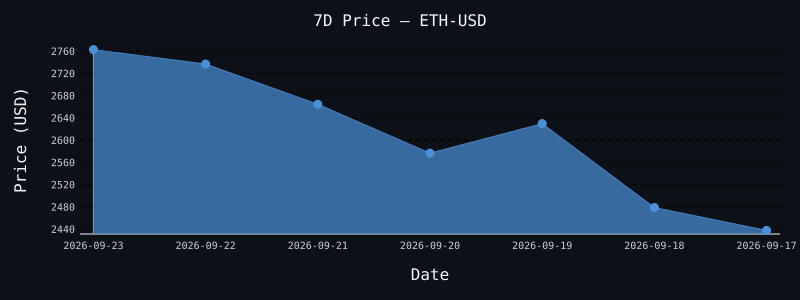
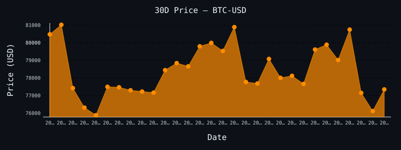
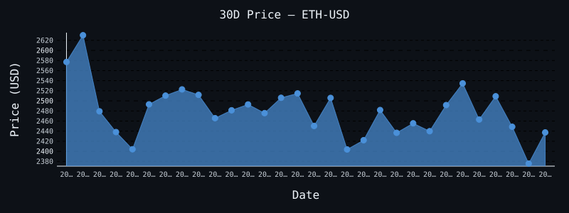
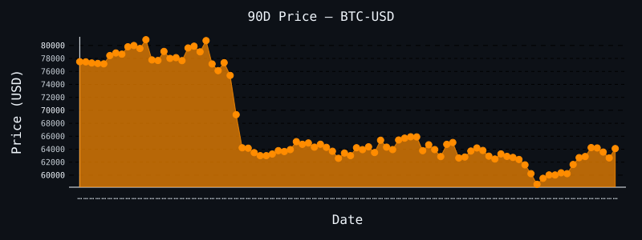
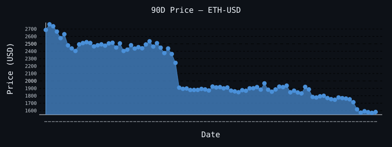
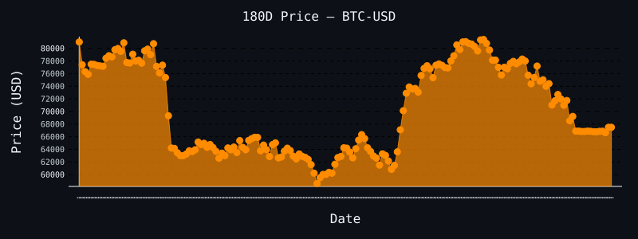
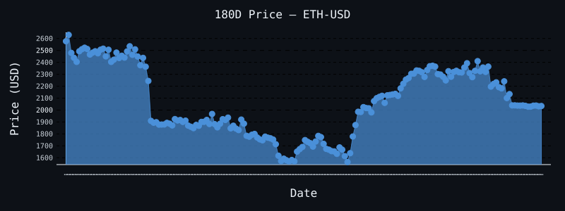
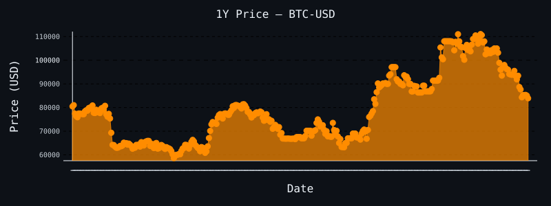
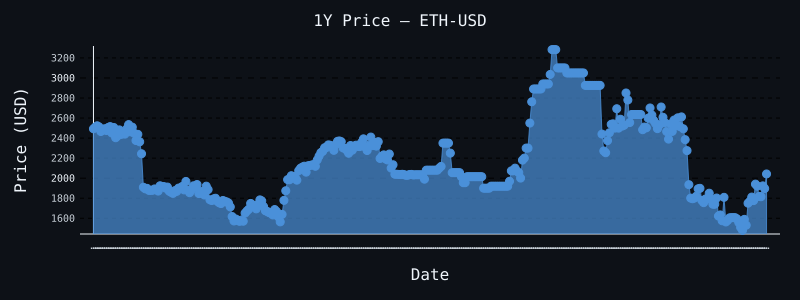

# Cryptocurrency Board

> Last updated: 2026-08-06 06:42 UTC

## Market Overview

| Coin | Price (USD) | 24h Change |
| ---- | ----------- | ---------- |
| **BTC** | **$64,768.00** | ▲ +0.8% |
| **ETH** | **$1,911.32** | ▲ +2.2% |

## 7-Day Dashboard

| Coin | Min | Max | Avg | Median | Return % | Volatility |
|------|-----|-----|-----|--------|----------|------------|
| **BTC** | $62,598.00 | $64,768.00 | $63,712.00 | $63,685.00 | +0.8% | 1.41% |
| **ETH** | $1,848.43 | $1,911.32 | $1,876.21 | $1,869.70 | +0.6% | 1.47% |

## 30D Dashboard

| Coin | Min | Max | Avg | Median | Return % | Volatility |
|------|-----|-----|-----|--------|----------|------------|
| **BTC** | $62,488.00 | $65,915.00 | $64,066.63 | $63,943.00 | +3.6% | 1.64% |
| **ETH** | $1,746.75 | $1,967.49 | $1,860.84 | $1,869.27 | +9.4% | 2.31% |

## 90D Dashboard

| Coin | Min | Max | Avg | Median | Return % | Volatility |
|------|-----|-----|-----|--------|----------|------------|
| **BTC** | $58,587.00 | $81,071.00 | $67,113.80 | $64,191.00 | -19.3% | 1.71% |
| **ETH** | $1,564.23 | $2,332.12 | $1,870.39 | $1,851.74 | -17.5% | 2.43% |

## 180D Dashboard

| Coin | Min | Max | Avg | Median | Return % | Volatility |
|------|-----|-----|-----|--------|----------|------------|
| **BTC** | $58,587.00 | $81,410.00 | $69,082.95 | $67,301.50 | -6.1% | 1.92% |
| **ETH** | $1,564.23 | $2,410.17 | $2,002.83 | $2,014.65 | -0.5% | 2.43% |

## 1Y Dashboard

| Coin | Min | Max | Avg | Median | Return % | Volatility |
|------|-----|-----|-----|--------|----------|------------|
| **BTC** | $58,587.00 | $111,065.37 | $80,365.57 | $78,146.00 | -23.8% | 2.28% |
| **ETH** | $1,479.00 | $3,282.87 | $2,177.16 | $2,073.22 | -35.2% | 3.70% |

---

## Deep Stats

### 1Y

| Coin    | Range %                                                 | Drawdown %                                                 |
| ------- | ------------------------------------------------------- | ---------------------------------------------------------- |
| **BTC** | 89.6% | 47.2% |
| **ETH** | 122.0% | 52.4% |

