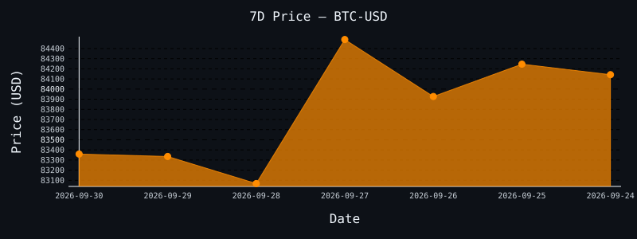
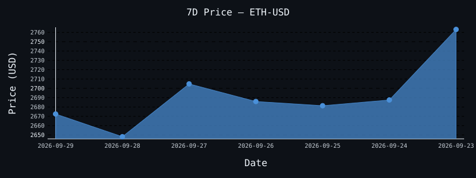
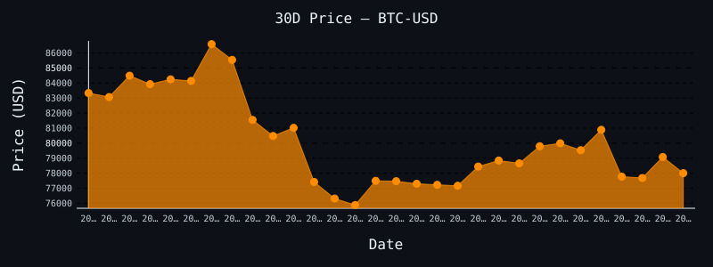
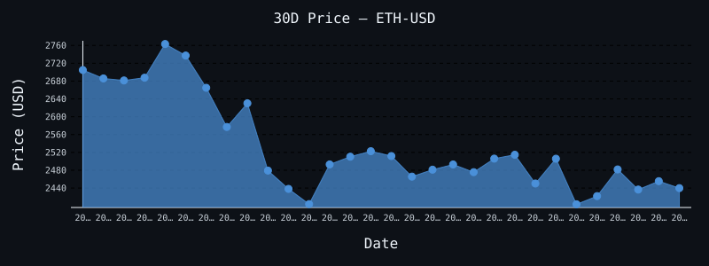
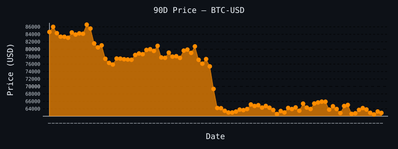
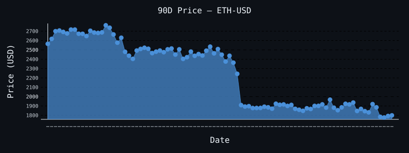
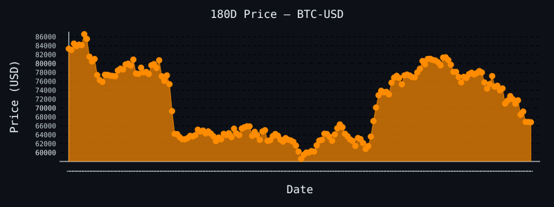
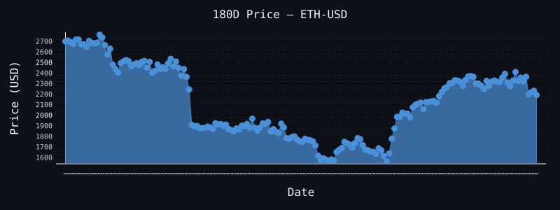
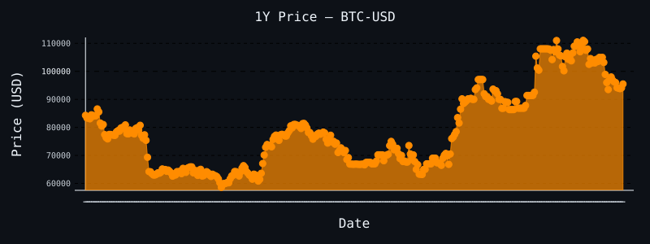
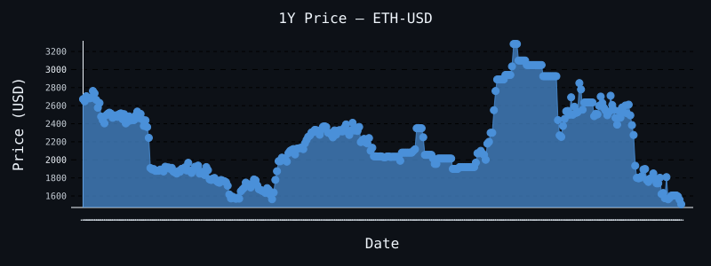

# Cryptocurrency Board

> Last updated: 2026-10-04 07:37 UTC

## Market Overview

| Coin | Price (USD) | 24h Change |
| ---- | ----------- | ---------- |
| **BTC** | **$84,927.00** | ▲ +0.3% |
| **ETH** | **$2,692.24** | ▲ +0.4% |

## 7-Day Dashboard

| Coin | Min | Max | Avg | Median | Return % | Volatility |
|------|-----|-----|-----|--------|----------|------------|
| **BTC** | $83,068.00 | $86,001.00 | $84,229.57 | $84,299.00 | +2.2% | 1.21% |
| **ETH** | $2,648.15 | $2,717.39 | $2,685.28 | $2,676.31 | +1.7% | 1.07% |

## 30D Dashboard

| Coin | Min | Max | Avg | Median | Return % | Volatility |
|------|-----|-----|-----|--------|----------|------------|
| **BTC** | $75,884.00 | $86,587.00 | $81,104.37 | $80,749.00 | +6.8% | 1.68% |
| **ETH** | $2,404.06 | $2,763.16 | $2,589.17 | $2,603.61 | +9.9% | 1.96% |

## 90D Dashboard

| Coin | Min | Max | Avg | Median | Return % | Volatility |
|------|-----|-----|-----|--------|----------|------------|
| **BTC** | $62,488.00 | $86,587.00 | $72,154.28 | $72,353.50 | +34.2% | 2.03% |
| **ETH** | $1,746.75 | $2,763.16 | $2,210.35 | $2,303.53 | +51.5% | 2.77% |

## 180D Dashboard

| Coin | Min | Max | Avg | Median | Return % | Volatility |
|------|-----|-----|-----|--------|----------|------------|
| **BTC** | $58,587.00 | $86,587.00 | $71,739.38 | $73,773.50 | +18.4% | 1.90% |
| **ETH** | $1,564.23 | $2,763.16 | $2,117.20 | $2,121.50 | +20.1% | 2.63% |

## 1Y Dashboard

| Coin | Min | Max | Avg | Median | Return % | Volatility |
|------|-----|-----|-----|--------|----------|------------|
| **BTC** | $58,587.00 | $111,065.37 | $78,878.13 | $76,962.00 | -9.7% | 2.21% |
| **ETH** | $1,563.14 | $3,282.87 | $2,227.31 | $2,133.80 | +67.6% | 3.41% |

---

## Deep Stats

### 1Y

| Coin    | Range %                                                 | Drawdown %                                                 |
| ------- | ------------------------------------------------------- | ---------------------------------------------------------- |
| **BTC** | 89.6% | 47.2% |
| **ETH** | 110.0% | 52.4% |

