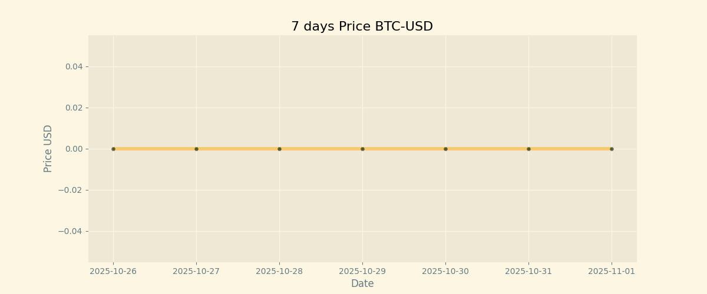
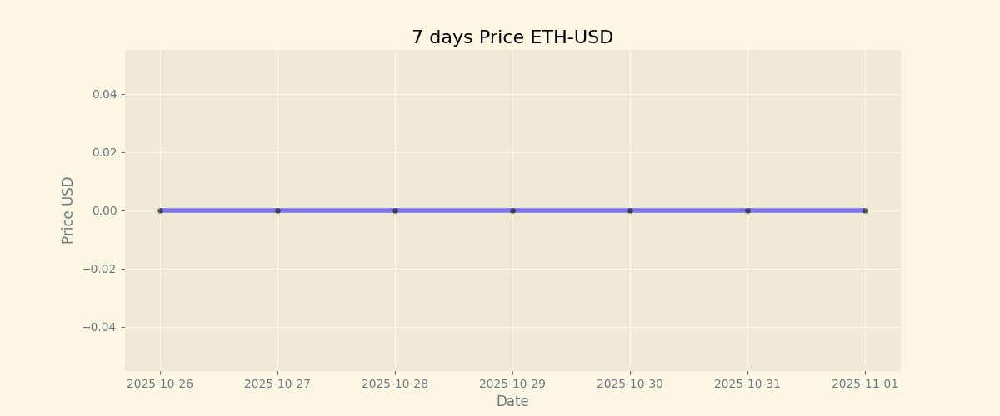

# CryptoCurrency-board

## Features

- cryptocurrency prices for 7 days
- Historical price charts for 7 days

## Today Price

| Currency | Price           |
| -------- | --------------- |
| **BTC**  | **$ 87892.78** |
| **ETH**  | **$ 2185.6** |

## BTC chart



## ETH chart



## Installation

1. Clone the repository: `git clone https://github.com/your-username/cryptocurrency-board.git`

## Usage

```
pip install -r requirements.txt
python main.py
```

## Contributing

Contributions are welcome! If you have any ideas, suggestions, or bug reports, please open an issue or submit a pull request.

## License

This project is licensed under the MIT License. See the [LICENSE](./LICENSE) file for more information.